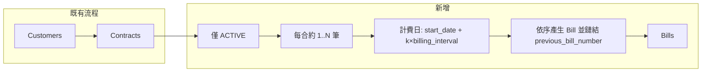

# Bill 測試資料產生計畫

> **概述**：在 [backend/scripts/generate_fake_data.py](backend/scripts/generate_fake_data.py) 中新增 Bill 測試資料的產生邏輯：僅對 **status 為 ACTIVE** 的合約產生帳單，第一筆以合約起始日為計費日，後續依 billing_interval 遞推；amount / tax_amount 依 contract.invoice_type 計算，並正確串接 previous_bill_number。

---

## 現狀

- [backend/scripts/generate_fake_data.py](backend/scripts/generate_fake_data.py) 目前只產生 **customers** 與 **contracts**（ACTIVE 客戶每人 1～3 份合約），沒有產生 bills。
- Bill 必填欄位與關聯：`bill_number`（PK）、`customer_id`、`contract_id`、`amount`、`tax_amount`、`monthly_rent`、`invoice_type`、`status`、`notes`；`previous_bill_number` 為系統串鏈（第一筆 null，其餘指向前一筆的 `bill_number`）。
- 帳單編號格式與 [backend/app/services/bill_service.py](backend/app/services/bill_service.py) 一致：`B-{year}-{month:02d}-{5 個大寫英文字母}`。

## Contract 對 Bill 的影響與產生條件

- **僅對 status 為 ACTIVE 的合約產生 bill**；**PENDING、TRIAL、ENDED、TERMINATED 皆不產生**。
- **第一筆 bill 的計費起始日 = 合約起始日**（`contract.start_date`）。
- **後續 bills** 依合約的 **billing_interval** 遞推計費日：`start_date`、`start_date + 1*interval`、`start_date + 2*interval`、…（直到合約結束或取滿 N 筆為止）。
- 下列 **contract 欄位會影響 bill**：
  - **monthly_rent** → bill 的 `monthly_rent`，並參與 `amount` / `tax_amount` 計算。
  - **billing_interval** → 決定計費區間與 `amount` / `tax_amount` 的區間倍數（月數）。
  - **invoice_type** → bill 的 `invoice_type`，並決定 **tax_amount** 與 **amount** 公式（見下）。
  - **payment_method** → 目前 Bill 表無此欄位，可於 `notes` 中註記或保留給未來欄位使用。
  - **status** → 僅 **ACTIVE** 產生 bills。

### amount / tax_amount 依 invoice_type 計算

- 令 `interval_months = int(contract.billing_interval.value)`，`base = monthly_rent * interval_months`。
- **tax_amount**：
  - `invoice_type == TRIPLE_UNIFORM_INVOICE`（三聯式發票）：`tax_amount = base * 0.05`（即 `monthly_rent * billing_interval * 0.05`）。
  - `invoice_type` 為 **NO_INVOICE** 或 **DUPLICATE_UNIFORM_INVOICE**：`tax_amount = 0`。
- **amount**（一律）：`amount = base + tax_amount` = `monthly_rent * interval_months + tax_amount`（三聯時即 `monthly_rent * billing_interval + monthly_rent * billing_interval * 0.05`）。

## 實作要點

### 1. 保留已建立的 Contract 清單

目前合約在迴圈裡 `session.add(contract)` 後沒有存成 list，之後無法依合約產生帳單。改為將每個產生的 `Contract` 放進一個 list（例如 `contracts: list[Contract]`），在 commit 後用這份清單來產生 bills。

### 2. 新增 Bill 編號產生函式

- 函式：`_generate_bill_number(billing_date: datetime, used: set[str]) -> str`
- 格式：`B-{year}-{month:02d}-{5 個隨機大寫字母}`，與 [bill_service 的 \_generate_bill_number](backend/app/services/bill_service.py) 一致。
- 使用 `used` set 避免與同批次已產生的 bill_number 重複（重複則重新產生 suffix）。

### 3. 新增「單筆 Bill」產生函式

- 函式：`generate_bill(contract, previous_bill_number, billing_date, used_bill_numbers) -> Bill`（回傳 [app.database.models.bill.Bill](backend/app/database/models/bill.py)）。
- 參數：
  - `contract`: 已建立的 Contract（取得 `customer_id`, `contract_id`, `monthly_rent`, `invoice_type`, `billing_interval`, `payment_method`）。
  - `previous_bill_number`: 該合約上一張帳單的 `bill_number`，第一張為 `None`。
  - `billing_date`: 此帳單的計費起始日（第一筆 = contract.start_date，後續依 billing_interval 遞推）；用來產生 `B-YYYY-MM-XXXXX` 與 `due_date`。
  - `used_bill_numbers`: 本批次已使用的 bill_number set，用來產生不重複的編號並回填。
- 欄位賦值建議：
  - `bill_number`: 呼叫 `_generate_bill_number(billing_date, used_bill_numbers)`，並把結果加入 `used_bill_numbers`。
  - `customer_id` / `contract_id`: 來自 `contract`。
  - **amount / tax_amount**（依 `contract.invoice_type`）：
    - `interval_months = int(contract.billing_interval.value)`，`base = contract.monthly_rent * interval_months`。
    - 若 `invoice_type == InvoiceType.TRIPLE_UNIFORM_INVOICE`：`tax_amount = base * 0.05`；否則（NO_INVOICE / DUPLICATE_UNIFORM_INVOICE）：`tax_amount = 0`。
    - `amount = base + tax_amount`。
  - `monthly_rent`: `contract.monthly_rent`。
  - `invoice_type`: `contract.invoice_type`。
  - `notes`: 可選註記 `payment_method` 或簡短隨機備註（符合 200 字以內）。
  - `status`: 從 `BillStatus` 隨機（DRAFT, SENT, PROCESSING, PAID, OVERDUE, CANCELLED）；若為 PAID 需設 `paid_at`，若為 SENT/PROCESSING/PAID 可設 `sent_at`。
  - `previous_bill_number`: 傳入參數。
  - `created_at` / `updated_at`: 以 `billing_date` 為基準前後微調。
  - `due_date`: 例如 `billing_date + 7 天` 或當月月底。
  - `sent_at`: 當 status 為 SENT/PROCESSING/PAID 時設為 billing_date 附近。
  - `paid_at`: 當 status 為 PAID 時設為 sent_at 之後。

### 4. 僅對 ACTIVE 合約產生 Bill，計費日依 start_date + billing_interval

- **篩選合約**：只處理 `contract.status == ContractStatus.ACTIVE`；**跳過 PENDING、TRIAL、ENDED、TERMINATED**。
- 對每個 ACTIVE `contract`：
  - **計費日序列**：第一筆計費日 = `contract.start_date`；之後為 `start_date + 1*interval_months`、`start_date + 2*interval_months`、…（`interval_months = int(contract.billing_interval.value)`）。可設上限筆數（例如 2～6 筆）或依 `contract.end_date` 截斷。
  - 依時間順序，對每個計費日呼叫 `generate_bill(contract, prev_bill_number, billing_date, used_bill_numbers)`；第一筆 `prev_bill_number=None`，之後為上一筆的 `bill_number`。
  - 將每筆 `Bill` 做 `session.add(bill)`。
- 全部 bills 加入後再 `await session.commit()`，並在 Summary 中印出產生的 bill 數量（以及「僅為 ACTIVE 合約產生」的說明）。

### 5. 依賴與匯入

- 從 `app.database.models.bill` 匯入 `Bill`。
- 從 `app.api.schemas.bill` 匯入 `BillStatus`。
- 腳本已匯入 `ContractStatus`、`InvoiceType`（contract schema）；用於篩選「僅 ACTIVE」合約與計算 tax_amount / amount。

## 資料流（概念）

## 檔案變更

| 檔案                                                                           | 變更                                                                                                                                                                                     |
| ------------------------------------------------------------------------------ | ---------------------------------------------------------------------------------------------------------------------------------------------------------------------------------------- |
| [backend/scripts/generate_fake_data.py](backend/scripts/generate_fake_data.py) | 1) 保留 `contracts` list；2) 新增 `_generate_bill_number`；3) 新增 `generate_bill`；4) 在 commit contracts 後，依每個 contract 產生 1～N 筆 bills 並 commit；5) Summary 加上 bill 數量。 |

## 注意事項

- 使用 **DB Model**（`app.database.models.bill.Bill`）直接建 instance 並 `session.add`，不經 API schema 或 BillService，因此不需處理 Pydantic 的 `model_validator`（例如 PAID 要有 `paid_at`）；但為資料合理，仍建議在產生 PAID 時設定 `paid_at`、SENT 時設定 `sent_at`。
- `bill_number` 唯一性由同批次 `used_bill_numbers` 保證即可；若未來要與既有 DB 資料併跑，可改為查詢現有 bill_number 再納入 set。
